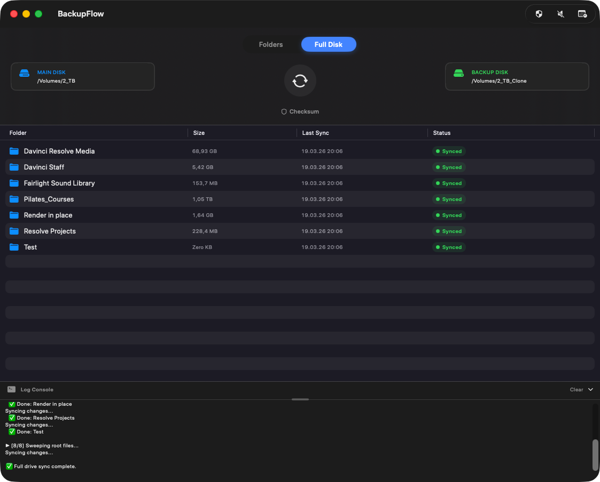

<h1 align="center">BackupFlow</h1>
<p align="center">
  
</p>

<p align="center">
  
  
  
  
</p>

<p align="center">
  <b>A native, menu-bar-first synchronization and backup tool for macOS.</b><br>
  Built with SwiftUI, powered by <code>rsync</code>, and designed for professional workflows.
</p>

---

## 🚀 Overview

**BackupFlow** is a lightweight, background-focused macOS utility that ensures your critical folders or entire disks are perfectly mirrored to a backup location. Designed specifically for users dealing with large files (video editors, developers, audio engineers), it leverages the proven reliability of `rsync` while wrapping it in a beautiful, unobtrusive SwiftUI interface.

Unlike bulky cloud clients or complex terminal scripts, BackupFlow lives quietly in your Menu Bar, running scheduled tasks or manual syncs without interrupting your workflow.

---

## ✨ Features (v1.6.2)

### Core
- **📁 Custom Folders** — Hand-pick specific directories to back up with per-folder progress bars.
- **💽 Full Disk Mirror** — Create a 1:1 true mirror of an entire volume (`rsync --delete`).
- **🔄 True Mirroring** — Files deleted on the source are automatically removed from the backup, preventing stale data accumulation.
- **⏱ Smart Scheduling** — Background timer supports intervals from 15 minutes to a week. Syncs silently without opening a window.

### Pro Features (v1.6.2)
- **🛡️ Advanced Deletion Guard (v1.6.x)** — Intelligent pre-sync analysis with granular per-file confirmation to avert accidental data loss.
- **✨ Smart UX** — Added "Apply to all" logic and a global safety toggle in the toolbar.
- **🔍 Transparency** — Detailed deletion logging in the internal Log Console.
- **🔬 Deep Checksum Verification** — Toggle on to compare every file's SHA1 hash, not just size/date. Catches corruption that timestamps miss. Status badge updates to **"Verifying"** during this phase.
- **🛡️ Rock-Solid Task Management** — Immediate termination of all background processes on abort or app exit (no zombie tasks).
- **🛑 Safe Cancellation** — Intelligent sync loop that prevents cascading status changes after a manual stop.
- **📊 Calibrated Progress (All 4 Modes)** — Progress rings and row bars are driven by the `to-chk=X/Y` rsync queue position, which is immune to checksum false-completions.
- **🔒 Strict Phase Separation** — Three distinct sync states:

| Phase | Status Badge | Ring |
|---|---|---|
| Dry-run size calc | `Calculating...` 🔘 | Pulsing |
| Active transfer | `Syncing` 🔵 | Progressing (0.01 – 0.99) |
| Checksum transfer | `Verifying` 🟠 | Progressing (0.01 – 0.99) |
| Complete | `Synced` 🟢 | 100% |
| Cancelled | `Aborted` 🟠 | Hidden |

- **🔌 Smart Disk Detection** — 5-second watchdog timer + `NSWorkspace` mount/unmount notifications. Folder list clears immediately when a disk is ejected; restores automatically on reconnect.

### Architecture
- **Menu Bar Agent** (`LSUIElement`) — No Dock icon. Lives entirely in the Menu Bar.
- **App Sandbox** — Uses Security-Scoped Bookmarks for persistent cross-session drive access.
- **Metadata Filtering** — Excludes `.DS_Store`, `.Spotlight-V100`, `.Trashes`, `.fseventsd`, and other macOS system files.
- **Local-Only** — No network requests, no telemetry, no cloud sync. All data stays on your drives.

---

## 🛠 How It Works

When a sync is triggered:

1. **Phase 1 — Calculating:** A dry-run (`rsync -n --stats`) counts bytes per folder. UI shows `Calculating...`, progress stays at 0. This output is **never** fed to the progress bars.
2. **Phase 2 — Transferring:** The real `rsync` process starts. The `to-chk=REMAINING/TOTAL` token is parsed from `--progress` output. Progress is strictly clamped to `0.01 – 0.99` until the process exits.
3. **Phase 3 — Completed:** Only when `rsync` exits with code 0, progress snaps to `1.0` and status becomes `Synced`.

**Rsync Flags Used:**
```
-av --delete --progress --no-perms --no-owner --no-group
--exclude={.DS_Store,._*,.Spotlight-V100,.Trashes,.fseventsd,...}
[--checksum if Deep Checksum is enabled]
```

---

## 🖥 Installation

### Prerequisites
- macOS 15.0 (Sequoia) or newer.
- Xcode 15.0+ installed.

### Steps
```bash
git clone https://github.com/antonsb13/BackupFlow.git
cd BackupFlow
open BackupFlow.xcodeproj
```

In Xcode → Project Settings → Signing & Capabilities:
- Select your Apple Developer Team.
- Verify the App Sandbox is enabled with "User Selected File" → Read/Write.

Then press `Cmd + R` to build and run.

---

## 📖 Usage

1. **Launch** — Click the BackupFlow icon in your Menu Bar.
2. **Select Drives** — Click the left card for the **Main Disk** (source), right card for **Backup Disk** (destination).
3. **Choose Mode** — **Folders** (custom dirs) or **Full Disk** (complete mirror toggle).
4. **Optional: Deep Checksum** — Enable the checksum toggle for byte-perfect verification.
5. **Sync** — Press the circular Sync button. Watch the per-row and global progress rings.
6. **Schedule** — Click the Calendar icon to configure auto-sync intervals.

---

## 🔒 Privacy

BackupFlow collects **zero** user data. See [PRIVACY.md](PRIVACY.md) for the full policy.

---

## 📄 License

MIT License — see [LICENSE](LICENSE) for details.

---
*Built with ❤️ for macOS. v1.6.2 — March 2026.*
